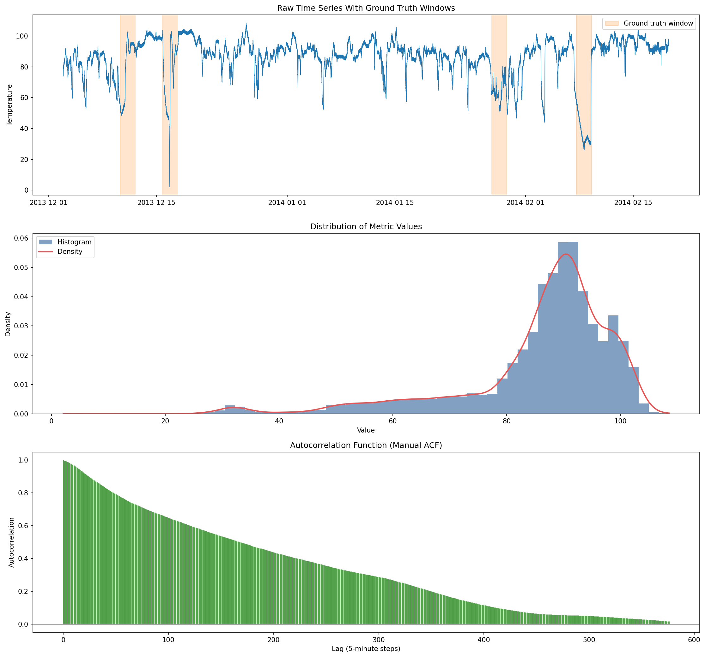
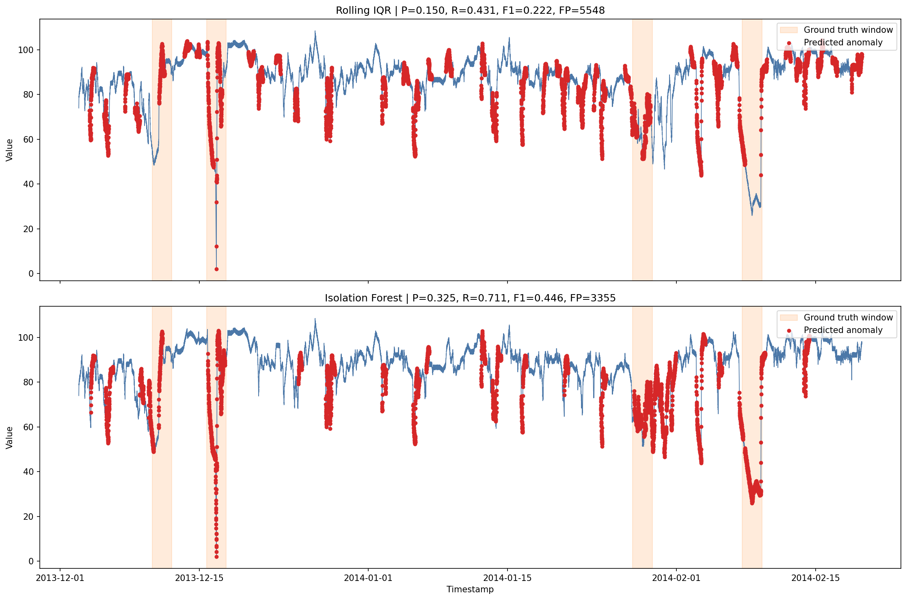

# W1-D1 Submission

## Dataset

- Dataset: `data/realKnownCause/machine_temperature_system_failure.csv`
- Label source: `labels/combined_windows.json`
- Granularity: `5 minutes`
- Time range: `2013-12-02 21:15:00` to `2014-02-19 15:25:00`

## EDA Summary

- Mean: `85.93`
- Std: `13.75`
- Skewness: `-1.83`
- Min / Max: `2.08 / 108.51`
- ACF observation: very strong short-lag autocorrelation, but no strong daily repeating seasonal peak.
- Conclusion: the series is heavily skewed because failure periods drag values sharply downward. I used `Rolling IQR` as the statistical baseline and `Isolation Forest` as the ML detector.

`statsmodels` was not available in the local environment, so the ACF plot was generated manually with normalized autocorrelation. This does not change the detector choice for this dataset.

## EDA Screenshot

## Detector Comparison

| Metric | Rolling IQR | Isolation Forest |
| --- | ---: | ---: |
| Precision | 0.150 | 0.325 |
| Recall | 0.431 | 0.711 |
| F1 | 0.222 | 0.446 |
| False Alarms | 5548 | 3355 |
| True Positives | 978 | 1613 |
| False Negatives | 1290 | 655 |
| Predicted Anomalies | 6526 | 4968 |

Best statistical config:

- `window=288`
- `multiplier=2.0`
- `cooldown=96` steps (`8 hours`)

Best Isolation Forest config:

- `contamination=0.05`
- `cooldown=96` steps (`8 hours`)
- Features: `value`, rolling mean/std, rate of change, lag, hour, day of week, EMA ratio

## Detector Screenshot

## Tuning Log

### Rolling IQR

| window | multiplier | cooldown | Precision | Recall | F1 | False Alarms |
| --- | ---: | ---: | ---: | ---: | ---: | ---: |
| 288 | 1.5 | 0 | 0.157 | 0.165 | 0.161 | 2008 |
| 288 | 2.0 | 48 | 0.145 | 0.278 | 0.190 | 3717 |
| 288 | 2.0 | 96 | 0.150 | 0.431 | 0.222 | 5548 |

### Isolation Forest

| contamination | cooldown | Precision | Recall | F1 | False Alarms |
| --- | ---: | ---: | ---: | ---: | ---: |
| 0.01 | 96 | 0.339 | 0.283 | 0.308 | 1252 |
| 0.02 | 96 | 0.313 | 0.315 | 0.314 | 1566 |
| 0.05 | 96 | 0.325 | 0.711 | 0.446 | 3355 |

Notes on tuning:

- I also tested shorter cooldown values (`0`, `12`, `24`, `48`) for both detectors.
- For `Isolation Forest`, `contamination=0.05, cooldown=24` gave a more balanced trade-off: `Precision=0.410`, `Recall=0.478`, `F1=0.442`, `False Alarms=1562`.
- I kept `0.05, cooldown=96` as the top-score config because the assignment emphasizes recall, and it produced the highest F1 and much higher recall.

## Reflection

This dataset is not a strong seasonal series. The daily-lag autocorrelation exists but is much weaker than the short-lag dependence, so I did not use STL. The global skewness is strongly negative because the anomaly windows include large drops during machine failure, which makes a mean/std threshold less reliable. That is why I used `Rolling IQR` instead of `Rolling Z-score`.

`Rolling IQR` works as a simple explainable baseline, but it is weak on this dataset. It tends to fire many alerts and still misses a large portion of the anomaly windows. The `Isolation Forest` performs better because the engineered features capture local context such as recent mean, recent volatility, lagged values, and rate of change. That lets it recognize failure patterns more effectively than a pure threshold method.

The cooldown post-processing matters a lot here. NAB labels anomaly windows, not isolated timestamps. If the detector identifies the start of an incident, keeping the alert open for a while is operationally reasonable and improves point-wise recall. Without cooldown, both detectors looked worse than they should for long anomaly windows.

For production, I would choose `Isolation Forest`. If the goal is maximum recall, I would use the selected `contamination=0.05, cooldown=96` configuration. If the team wants a calmer alert stream with fewer false positives, I would switch to `contamination=0.05, cooldown=24`, because it keeps almost the same F1 with much better precision and fewer false alarms.

## Artifacts

- Notebook: `assignment.ipynb`
- Submission summary: `SUBMIT.md`
- Comparison metrics: `deliverables/w1_day_a/metrics/comparison_summary.csv`
- Rolling IQR tuning log: `deliverables/w1_day_a/metrics/rolling_iqr_tuning.csv`
- Isolation Forest tuning log: `deliverables/w1_day_a/metrics/isolation_forest_tuning.csv`
- Model artifact: `deliverables/w1_day_a/models/isolation_forest.joblib`
- Knowledge check photo 1: `deliverables/w1_day_a/photos/knowledge_check1.jpg`
- Knowledge check photo 2: `deliverables/w1_day_a/photos/knowledge_check2.jpg`
- Knowledge check photo 3: `deliverables/w1_day_a/photos/knowledge_check3.jpg`

## Remaining Manual Item

The handwritten knowledge check photos are the only deliverables I could not produce automatically. They are included at:

- `deliverables/w1_day_a/photos/knowledge_check1.jpg`
- `deliverables/w1_day_a/photos/knowledge_check2.jpg`
- `deliverables/w1_day_a/photos/knowledge_check3.jpg`

The implementation and analysis above are complete and can be used to prepare that final manual submission item.
