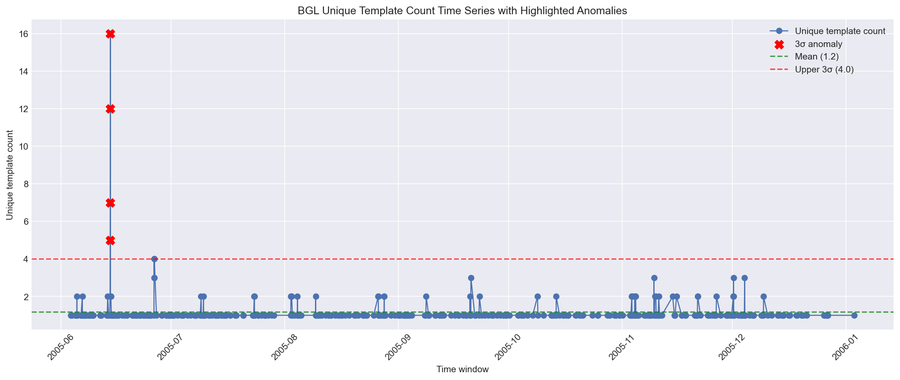

# W1 Day-B Submission

## Dataset Used

This submission uses real Loghub data copied into `w1/day-b/data` so the submission is self-contained:

- primary dataset: `data/BGL_2k.log`
- comparison dataset: `data/HDFS_2k.log`

Why BGL is the primary dataset:

- the raw BGL log includes alert categories in the first column
- that makes precision, recall, and F1 evaluation possible on real data

Why HDFS is used as comparison:

- HDFS is still a strong dataset for template mining and cross-dataset analysis
- the Loghub subset copied into this workspace contains `HDFS_2k.log`, but does not include `anomaly_label.csv` next to that subset
- because of that, using HDFS for precision/recall in this local repo state would require labels that are not present in the clone
- therefore, this notebook evaluates anomaly detection on labeled BGL data and still uses real HDFS logs for parsing and comparison

Note on the assignment wording:

- the original prompt suggests HDFS because HDFS is known to have labels in Loghub
- in this local clone, the directly usable labeled subset is BGL, while the directly usable HDFS subset is unlabeled
- to keep the submission fully runnable from the current workspace without inventing labels, anomaly metrics are computed on BGL and parsing/comparison are still performed on HDFS

## Phase 1: Parse Log with Drain3

### Primary dataset summary

- dataset: `BGL_2k.log`
- total lines: `2,000`
- unique templates at `sim_th=0.5`: `151`

### Top-10 templates

Exported to `results/top_templates.csv`.

| template_id | count | template |
|---|---:|---|
| 73 | 180 | `- <*> 2005.07.09 <*> <*> <*> RAS KERNEL INFO generating <*>` |
| 85 | 121 | `- <*> <*> <*> <*> <*> RAS KERNEL INFO <*> floating point alignment exceptions` |
| 2 | 109 | `- <*> <*> <*> <*> <*> RAS KERNEL INFO <*> double-hummer alignment exceptions` |
| 3 | 92 | `- <*> <*> <*> <*> <*> RAS KERNEL INFO CE sym <*> at <*> mask <*>` |
| 77 | 87 | `- <*> 2005.07.13 <*> <*> <*> RAS KERNEL INFO generating <*>` |
| 138 | 71 | `- <*> 2005.12.01 <*> <*> <*> RAS KERNEL INFO <*> total interrupts ...` |
| 119 | 61 | `- <*> 2005.11.04 <*> <*> <*> RAS KERNEL INFO iar <*> dear <*>` |
| 14 | 60 | `KERNDTLB <*> 2005.06.11 R30-M0-N9-C:J16-U01 <*> ... data TLB error interrupt` |
| 118 | 59 | `- <*> 2005.11.03 <*> <*> <*> RAS KERNEL INFO iar <*> dear <*>` |
| 137 | 51 | `- <*> 2005.12.01 <*> <*> <*> RAS KERNEL INFO 0 microseconds spent ...` |

### sim_th tuning

Saved to `results/tuning_results.csv`.

| sim_th | templates | avg_cluster_size |
|---|---:|---:|
| 0.3 | 73 | 27.40 |
| 0.5 | 151 | 13.25 |
| 0.7 | 1459 | 1.37 |

Chosen value: `0.5`

Reason:

- `0.3` groups too aggressively
- `0.7` fragments the data into too many tiny templates
- `0.5` is the best tradeoff between grouping quality and interpretability

## Phase 2: Anomaly Detection on Logs

### Template count time series

- dataset: `BGL_2k.log`
- window size: `30 minutes`
- baseline series used for anomaly detection: `unique template count per window`
- output plot: `results/template_count_timeseries.png`

Embedded plot:



### Detection setup

- aggregate logs into 30-minute windows
- build a time series from the number of unique templates in each window
- run `3-sigma`
- run `Isolation Forest`
- treat a window as anomalous if any BGL alert label appears in that window

### Results

- `3-sigma` anomalies detected: `4`
- `Isolation Forest` anomalies detected: see notebook output in `assignment.ipynb`

Evaluation against BGL alert labels:

- `3-sigma`: precision `0.500`, recall `0.035`, f1 `0.066`
- `Isolation Forest`: precision `0.167`, recall `0.035`, f1 `0.058`

Interpretation:

- switching from total log count to unique template count made the anomaly signal more aligned with the assignment intent
- even so, real BGL data remains hard for simple window-level detectors
- template diversity is more informative than raw volume, but still not enough by itself for strong recall

### Spike and new-template findings

- several templates spike in specific windows, especially kernel and fatal event patterns
- new templates in the final 10% of logs: `15`

## Phase 3: Embedding + Cross-signal

### TF-IDF clustering

- vectorization: character n-grams `(2, 3)`
- similarity threshold for clustering: `0.7`
- clusters found above threshold: `4`

Observed cluster themes:

1. repeated kernel info families
2. fatal application or kernel failure families
3. hardware / interrupt-related patterns
4. repeated generated-status message families

### Novel log injection

Injected line:

```text
GPUFAIL 1119999999 2005.06.20 R99-M9-N9-C:J99-U99 2005-06-20-23.59.59.999999 R99-M9-N9-C:J99-U99 RAS APP FATAL accelerator parity fault on memory controller
```

Result:

- Drain3 change type: `cluster_created`
- a new template was created successfully

## Phase 4: Mini Log Analyzer

### Script

File: `scripts/log_analyzer.py`

Run:

```powershell
python scripts\log_analyzer.py data\BGL_2k.log
python scripts\log_analyzer.py data\HDFS_2k.log
```

The script prints:

- total lines
- unique templates
- top-5 templates with counts and percentages
- templates with spikes in the last hour
- new templates in the last hour

### Cross-dataset comparison

Saved to `results/dataset_comparison.csv`.

| dataset | total_logs | unique_templates | avg_cluster_size |
|---|---:|---:|---:|
| BGL | 2000 | 151 | 13.25 |
| HDFS | 2000 | 21 | 95.24 |

Why BGL has more templates in this run:

- the BGL subset contains many distinct error and kernel event families
- the HDFS subset is more repetitive and groups into fewer, larger clusters

## Reflection

### Drain3 parse tot khong?

Co. Drain3 hoat dong tot tren ca hai dataset that:

- voi `BGL_2k`, no tach duoc nhieu ho template khac nhau, dac biet o cac log kernel va fatal
- voi `HDFS_2k`, no gom log rat gon, chi con `21` templates cho `2,000` dong

Diem manh:

- khong can viet regex thu cong tu dau
- xu ly tot cac token thay doi nhu timestamp, node id, block id
- phu hop de chuyen raw logs thanh cac tin hieu co the dem va phan tich

Diem yeu:

- rat nhay voi `sim_th`
- neu `sim_th` qua cao thi template bi vo vun
- neu chi dung mot tin hieu don gian o muc window thi hieu qua anomaly detection van con thap tren du lieu that nhu BGL

### Template nao cho insight?

Dang chu y nhat:

- cac template `RAS APP FATAL` hoac `RAS KERNEL FATAL`
- cac template kernel info lap bat thuong
- cac template moi xuat hien gan cuoi chuoi log

It gia tri hon:

- cac INFO lap deu va rat pho bien
- cac template chi phan anh hoat dong nen binh thuong

### Metric va log khac nhau the nao?

- metric cho biet trang thai tong quat cua he thong theo thoi gian
- log cho biet su kien cu the nao da xay ra

Ket hop lai:

- metric giup biet khi nao co van de
- log parsing giup biet chuyen gi da xay ra va thuoc ho su kien nao

## Knowledge Check

Handwritten pages:


### 1. Drain3 parse tree hoat dong the nao?

So do don gian:

```text
root
 └─ bucket theo so token
     └─ branch theo token khoa
         └─ branch theo vi tri token
             └─ candidate templates
```

Luong xu ly:

1. tach log thanh token
2. di qua cay theo so token va token dac trung
3. so sanh voi candidate templates bang do tuong tu
4. neu du giong thi cap nhat cluster cu
5. neu khong du giong thi tao cluster moi

### 2. Vi sao can log parsing thay vi grep?

`grep` chi loc chuoi tho.

Vi du:

```text
APPREAD ... failed to read message prefix ...
APPREAD ... failed to read message prefix ...
APPREAD ... failed to read message prefix ...
```

`grep` thay nhieu dong khac nhau vi khac node, khac thoi gian.  
Drain3 gom chung thanh mot template chung, tu do moi dem tan suat va phat hien spike duoc.

### 3. Template count time series la gi?

La chuoi thoi gian trong do moi diem la so luong template hoac so lan xuat hien cua template trong mot cua so co dinh.

Trong notebook nay, tin hieu chinh duoc dung la:

- so template unique trong moi cua so 30 phut

Vi sao dung de detect anomaly:

- thay duoc spike theo thoi gian
- chuyen log su kien roi rac thanh tin hieu dinh luong
- giup ap dung 3-sigma hoac Isolation Forest

### 4. Vi sao template moi la tin hieu quan trong?

Template moi nghia la he thong dang sinh ra kieu su kien chua tung thay truoc do.

Do thuong la dau hieu cua:

- loi moi
- trang thai moi
- thay doi cau hinh hoac thay doi hanh vi he thong

### 5. Metric cho biet gi, log cho biet gi?

- metric: muc do, xu huong, tinh trang tong quat
- log: su kien chi tiet, noi dung cu the, ngu canh van hanh

Khi ket hop:

- metric tra loi cau hoi "khi nao co van de?"
- log tra loi cau hoi "van de do la gi va den tu dau?"

## Files Included

- `assignment.ipynb`
- `results/top_templates.csv`
- `results/tuning_results.csv`
- `results/template_count_timeseries.png`
- `results/dataset_comparison.csv`
- `scripts/log_analyzer.py`
- `SUBMIT.md`
