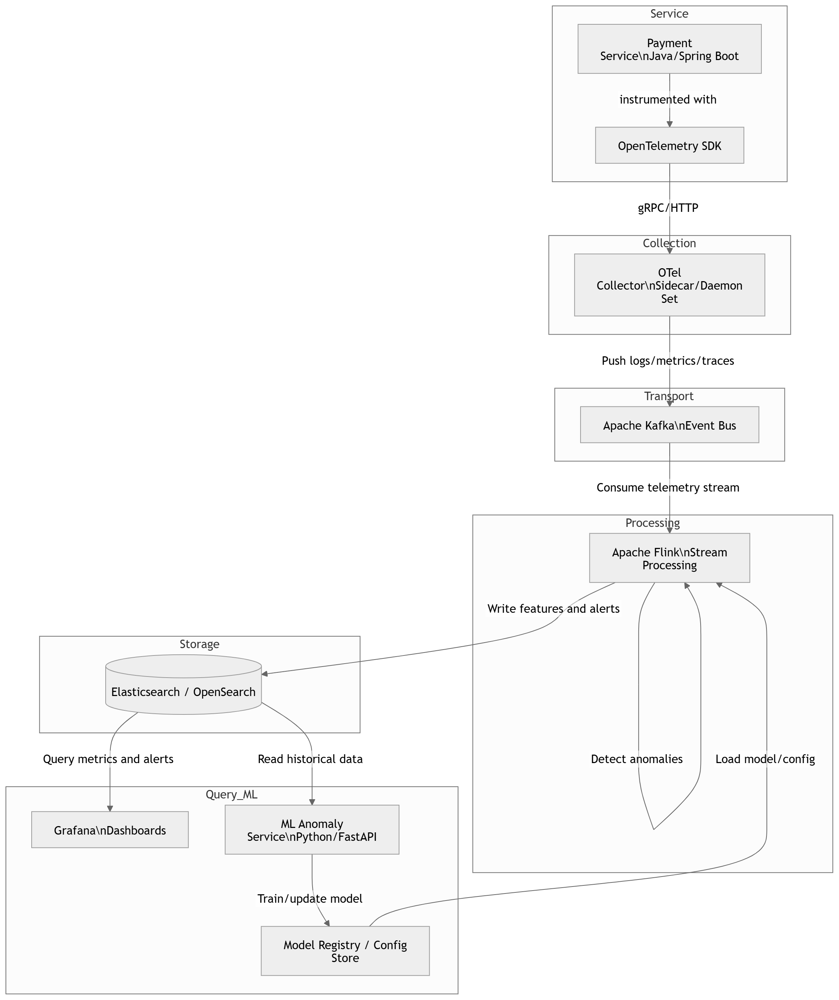

# Assignment Submission — Chiều Nay

## Phase 1: Architecture Diagram
Below is the Architecture Diagram for our AIOps use case (Anomaly detection on payment service):

## Phase 2: Cost Estimate Breakdown
Output generated from `cost_model.py`:

--- BUILD (Self-Host: OTel, Kafka, Flink, ES) ---
| Tier   | Storage   | Compute    | Network   | Total Build Cost   |
|--------|-----------|------------|-----------|--------------------|
| Small  | $150.00   | $600.00    | $530.00   | $1,280.00          |
| Medium | $1,500.00 | $4,500.00  | $5,300.00 | $11,300.00         |
| Large  | $15,000.00| $35,000.00 | $53,000.00| $103,000.00        |

--- BUY (Datadog SaaS) ---
| Tier   | APM/Services | Logs Cost  | Metrics Cost | Total Buy Cost |
|--------|--------------|------------|--------------|----------------|
| Small  | $310.00      | $3,750.00  | $15,000.00   | $19,060.00     |
| Medium | $3,100.00    | $37,500.00 | $150,000.00  | $190,600.00    |
| Large  | $31,000.00   | $375,000.00| $1,500,000.00| $1,906,000.00  |

--- COMPARISON (Build vs Buy) ---
| Tier   | Build Cost | Buy (SaaS) Cost | SaaS Premium (Buy - Build) |
|--------|------------|-----------------|----------------------------|
| Small  | $1,280.00  | $19,060.00      | $17,780.00                 |
| Medium | $11,300.00 | $190,600.00     | $179,300.00                |
| Large  | $103,000.00| $1,906,000.00   | $1,803,000.00              |

## Phase 3: ADR Summary
**Decision:** Use OpenTelemetry SDKs + OTel Collector instead of Vendor-specific (Datadog) SDKs.
**Reason:** Prevents massive vendor lock-in and allows tail-based sampling at the Collector level to control high observability costs. Allows a future transition to self-hosted tools (like Jaeger/Prometheus/ES) without touching 50+ microservice codebases. 
**Trade-offs:** We lose some out-of-the-box vendor magic (like Datadog continuous profiler deep integrations) and take on the operational burden of managing OTel Collectors.

## Phase 4: Reflection
**Question:** If you were hired as a Platform Engineer for a startup with 50 services that just raised a Series A, would you recommend build or buy? Why?

**My Recommendation:** **BUY (but with Vendor-Neutral Instrumentation)**.

**Reasoning:**
1. **Focus on Core Product:** For a Series A startup, engineering time is the most expensive and critical resource. A 50-service architecture is complex enough to need immediate, high-quality observability, but the company's primary focus should be finding product-market fit and scaling features, not managing Kafka clusters, Flink jobs, and Elasticsearch nodes.
2. **Time to Market:** Buying a SaaS solution like Datadog or New Relic gives the team instant dashboards, anomaly detection, and alerting from day one. Building an in-house AIOps pipeline (OTel -> Kafka -> Flink -> ES) would require months of engineering effort and dedicated full-time platform engineers just to maintain.
3. **The Compromise (Future-proofing):** Even though we BUY the backend, I would heavily advocate for **BUILDING the instrumentation using OpenTelemetry**. We will use Datadog/SaaS as the backend, but route telemetry through an OTel Collector. This avoids strict vendor lock-in. As the startup scales to Series C and log volumes make SaaS prohibitively expensive (as seen in the cost estimates above), we can seamlessly flip the switch at the Collector level to route high-volume logs to a cheaper self-hosted S3/ClickHouse cluster while keeping high-value metrics in the SaaS tool.
